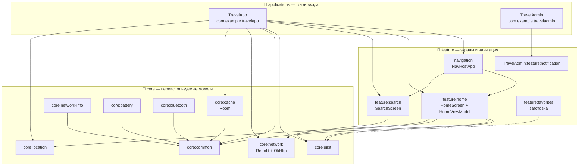
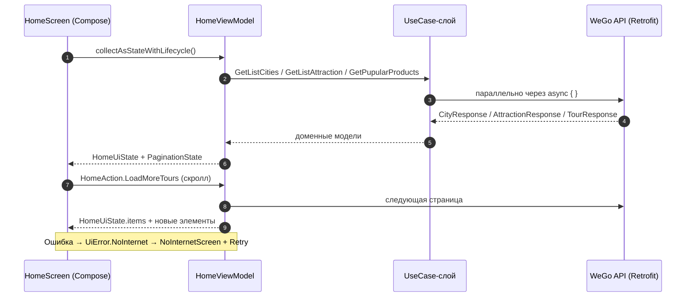
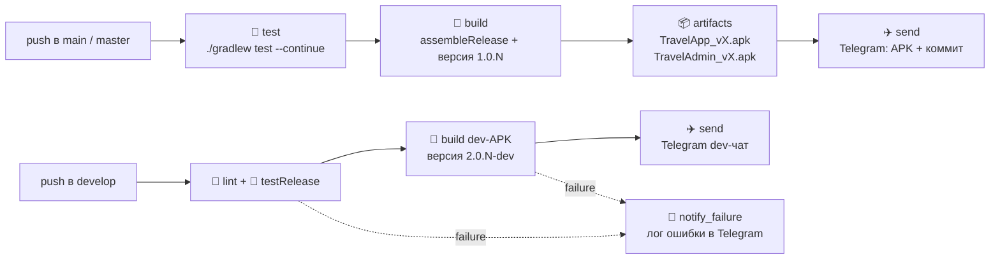

<!-- ═══════════════════ HERO ═══════════════════ -->

<p align="center">
  
</p>

<p align="center">
  <a href="https://github.com/JamikKhidirov/TravelApp/actions/workflows/main.yml">
    
  </a>
  <a href="https://github.com/JamikKhidirov/TravelApp/actions/workflows/develop.yml">
    
  </a>
  
  
  
  <a href="https://gitlab.com/dzamikhidirov8/travelapp">
    
  </a>
</p>


<p align="center">
  
</p>

<p align="center">
  
  
  
  
  
  
  
  
  
</p>

<!-- ═══════════════════ ОГЛАВЛЕНИЕ ═══════════════════ -->

## 📚 Оглавление

- [О проекте](#-о-проекте)
- [Что уже работает](#-что-уже-работает)
- [Скриншоты и анимации](#-скриншоты-и-анимации)
- [Архитектура](#-архитектура)
- [Технологический стек](#-технологический-стек)
- [Быстрый старт](#-быстрый-старт)
- [Конфигурация](#-конфигурация)
- [Тестирование](#-тестирование)
- [CI/CD](#-cicd)
- [Roadmap](#-roadmap)
- [Как помочь](#-как-помочь)
- [Автор](#-автор)
- [Лицензия](#-лицензия)

---

## 🔍 О проекте

**TravelApp** — нативное Android-приложение для поиска туров, экскурсий, городов и достопримечательностей.
Проект живёт в одном Gradle-репозитории с двумя точками входа:

| Модуль | Назначение | Состояние |
|--------|------------|-----------|
| 🧳 **`applications/TravelApp`** | Приложение для путешественников: главный экран, поиск | 🟢 Активная разработка |
| 🛠 **`applications/TravelAdmin`** | Push-модуль и экран уведомлений администратора | 🟡 Каркас |

Ключевая идея — **модульный монолит**: сеть, кэш, геолокация и UI-кит разнесены по модулям `core`,
а фичи подключаются как отдельные Gradle-модули. Сейчас в `settings.gradle.kts` объявлено **36 модулей**,
в репозитории **197 Kotlin-файлов** и **52 файла тестов**.

> 📌 Раздел [Roadmap](#-roadmap) честно показывает, что уже готово, а что находится в работе.

<p align="center">
  
</p>

---

## ✨ Что уже работает

### 🧳 Приложение для путешественников (TravelApp)

- 🧭 **Type-safe навигация** — `navigation-compose` + `@Serializable` маршруты `ScreenDestination` (Home, Search)
- 🔠 **Карточка поиска** закреплена как `stickyHeader` и ведёт на экран поиска
- 🗂 **Табы «Ближащие / Популярные»** — переключение мгновенно перезагружает подборку городов
- 🏙 **Карусель городов** и секция **«Еще популярные места»** (достопримечательности) с подгрузкой по скроллу
- 🎫 **Список популярных туров** на Coil: фото во весь фон, градиентный оверлей, рейтинг `⭐ 4.9`, бейдж **«Новинка»** для туров без оценки, город, длительность, цена и зачёркнутая старая цена
- ♾ **Пагинация** с порогом (`buffer = 2`), защитой от повторных запросов и `PaginationState`
- 💀 **Shimmer-скелетоны** и единый `LoadingScreen` — вместо спиннера «прыгающий» каркас будущего контента
- 📶 **Экран ошибки сети** — `NoInternetScreen` с кнопкой «Повторить попытку» (`HomeAction.Retry`)
- 🌗 **Темы** — светлая, тёмная и `dynamic color` на Android 12+, бренд-цвет `#FF8C00`
- 🚀 **Splash Screen** через `core-splashscreen` с удержанием 800 мс
- 📍 **Геолокация** — `FusedLocationProviderClient` + `foreground Service` (`LocationService`), обновление каждые 5 секунд
- 🔔 **Push-уведомления** Firebase (`PushNotificationService`, действие `MESSAGING_EVENT`)

### 🛠 Админ-контур (TravelAdmin)

- 📣 Модуль `core:pushing` и экран уведомлений `feature:notification` с собственным `PushTopBar`

### 🧱 Ядро (`core`)

- 🌐 **`core:network`** — Retrofit 3 + OkHttp: интерсепторы авторизации WeGo/Sputnik, `ProgressRequestBody`, `NetworkResult`, DI-модули
- 💾 **`core:cache`** — Room: `CityDatabase`, `CityDao`, `CityEntity` + `RoomModule`
- 📍 **`core:location`** — Clean Architecture: `LocationClient` → `LocationClientImpl`, `GetCurrentLocationUseCase`, `GetLocationUpdates`
- 📶 **`core:network-info`** — тип сети, детали Wi-Fi и сотовой сети, `ObserveNetworkStateUseCase`
- 🔋 **`core:battery`** — `BatteryDataSource` + instrumented-тесты c `CustomTestRunner`
- 🔵 **`core:bluetooth`** — BLE-сканирование: `AndroidBluetoothManagerImpl`, `BleScanState`
- 🎨 **`core:uikit`** — шиммеры, скелетоны, нижняя навигация, поисковая карточка, кнопки, состояния загрузки/ошибки

---

## 🎬 Скриншоты и анимации

<p align="center">
  
</p>

> ✨ В README встроена **живая SVG-анимация** интерфейса — она рисуется прямо на GitHub, работает в тёмной и светлой теме.
> Анимация повторяет реальную вёрстку: табы, shimmer по карточке тура, каретка поиска, пульсирующий экран ошибки сети
> и переключение активного пункта нижней навигации.

<details>
<summary><b>📸 Как добавить настоящие скриншоты и GIF-запись экрана</b></summary>

<br>

1. Скриншот с устройства или эмулятора:

   ```bash
   adb exec-out screencap -p > docs/screenshots/home.png
   ```

2. Запись демо-ролика:

   ```bash
   adb shell screenrecord /sdcard/demo.mp4
   adb pull /sdcard/demo.mp4 .
   ```

3. Конвертация в GIF:

   ```bash
   ffmpeg -i demo.mp4 -vf "fps=12,scale=360:-1" docs/screenshots/demo.gif
   ```

4. Вставка в этот README:

   ```html
   <p align="center">
     
     
     
   </p>
   ```

Полный чек-лист по кадрам — в [`docs/screenshots/README.md`](docs/screenshots/README.md).

</details>

---

## 🏗 Архитектура

Модульный монолит: точка входа **знает только о фичах**, фичи — о `core`-модулях, а `core` не знает ни о ком выше.



### 🔄 Поток данных главного экрана



### 📦 Карта модулей

| Модуль | За что отвечает | Статус |
|--------|-----------------|--------|
| `applications/TravelApp` | Пользовательское приложение, splash, сервисы, push | 🟢 готово |
| `applications/TravelApp:navigation` | `NavHost` и маршруты Home / Search | 🟢 готово |
| `applications/TravelApp:feature:home` | Главный экран, пагинация, состояние, UI-секции | 🟢 готово |
| `applications/TravelApp:feature:search` | Экран поиска, строка поиска, заготовка истории | 🟡 UI без данных |
| `applications/TravelApp:feature:favorites` | Избранное | 🚧 заготовка |
| `applications/TravelApp:core:network` | Retrofit/OkHttp, WeGo + Sputnik API, интерсепторы | 🟢 готово |
| `applications/TravelApp:core:cache` | Room-кэш городов | 🟢 готово |
| `core:uikit` | Дизайн-система: шиммеры, бары, кнопки, состояния | 🟢 готово |
| `core:common` | `ScreenDestination`, общие модели | 🟢 готово |
| `core:location` | Геолокация, use-cases, DI | 🟢 готово |
| `core:network-info` | Состояние сети, Wi-Fi/сотовая детализация | 🟢 готово, не подключён к UI |
| `core:battery` | Заряд и статус батареи | 🟢 готово, не подключён к UI |
| `core:bluetooth` | BLE-сканирование | 🟢 готово, не подключён к UI |
| `core:camera`, `contacts`, `device`, `sensors`, `storage`, `sync`, `wifi`, `worker` | Объявлены в Gradle, есть манифесты и тесты | 🚧 в работе |
| `applications/TravelAdmin` | Админ-панель: push-модуль, экран уведомлений | 🟡 каркас |
| `core:network:apis`, `core:network:firebase`, `core:network:supabase` | Заявлены в `settings.gradle.kts` | 🚧 планируется |

---

## 🧰 Технологический стек

| Категория | Технология | Версия |
|-----------|------------|--------|
| Язык | Kotlin | **2.1.0** |
| UI | Jetpack Compose + Material 3 | Compose BOM **2025.12.01**, Material3 **1.4.0** |
| Навигация | Navigation Compose (type-safe) | 2.8.5 |
| DI | Hilt, `hilt-navigation-compose` | 2.57.2 / 1.3.0 |
| Асинхронность | Coroutines, Flow, `kotlinx-coroutines-play-services` | 1.10.2 |
| Сериализация | `kotlinx-serialization-json` | 1.9.0 |
| Сеть | Retrofit, Gson converter, OkHttp logging-interceptor | 3.0.0 / 2.10.1 / 5.3.2 |
| Кэш | Room (runtime, ktx, compiler) | 2.8.4 |
| Изображения | Coil Compose | 2.7.0 |
| Фоновые задачи | WorkManager | 2.11.0 |
| Геолокация | `play-services-location` | 21.3.0 |
| Push | Firebase BOM + `firebase-messaging-ktx` | 34.11.0 / 24.1.2 |
| Splash | `androidx.core:core-splashscreen` | 1.2.0 |
| Отладка | LeakCanary (debug-вариант), OkHttp logging | 1.0.0 |
| Тесты | JUnit4, AndroidX Test (JUnit, Espresso), Compose UI Test | 4.13.2 / 1.3.0 / 3.7.0 |
| Сборка | AGP **8.13.2**, Gradle **8.13**, Kotlin DSL + version catalog (`libs.versions.toml`) | — |
| Автоматизация | GitHub Actions, Fastlane (лейн публикации в RuStore) | — |
| Java | `sourceCompatibility` / `jvmTarget` = 11, в CI — JDK 17 | — |

<p align="center">
  
</p>

---

## 🚀 Быстрый старт

### Требования

- 📱 **Android Studio** (Hedgehog или новее) либо JDK 17 + Android SDK
- ☕ **JDK 17** (в проекте `jvmTarget = 11`, CI использует Temurin 17)
- 🛠 **Android SDK**: `compileSdk 36`, `minSdk 24`, `targetSdk 34` (TravelApp) / 36 (TravelAdmin)
- 🐘 **Gradle 8.13** — уже в обёртке, отдельно ставить не нужно

### Клонирование

```bash
git clone https://github.com/JamikKhidirov/TravelApp.git
cd TravelApp
```

### Сборка и запуск

```bash
# Приложение для путешественников (debug)
./gradlew :applications:TravelApp:assembleDebug
adb install -r applications/TravelApp/build/outputs/apk/debug/TravelApp-debug.apk

# Админ-контур
./gradlew :applications:TravelAdmin:assembleDebug

# Release-сборка обеих точек входа с версией из CI
./gradlew assembleRelease -PversionCode=1 -PversionName="1.0.0"

# Все unit-тесты и линт
./gradlew test
./gradlew lintRelease
```

> 💡 Windows: используй `gradlew.bat` вместо `./gradlew`.

### Установка APK из CI

Каждая сборка в ветке `main`/`master` кладёт готовые APK в артефакты workflow
(`android-build-data`) и отправляет их в Telegram с описанием коммита.

---

## ⚙️ Конфигурация

### Firebase

Для сборки `TravelApp` обязателен файл `google-services.json` (плагин `com.google.gms.google-services` 4.4.4).
Файл лежит в репозитории по пути:

```
applications/TravelApp/google-services.json
```

### Подпись release-сборки

`applications/TravelApp/build.gradle.kts` объявляет `signingConfigs.release`, который читает переменные окружения:

```bash
KEYSTORE_PATH=/path/to/keystore.jks
KEYSTORE_PASSWORD=your_store_password
KEY_ALIAS=your_key_alias
KEY_PASSWORD=your_key_password
```

> ⚠️ **Важно:** в блоке `buildTypes.release` сейчас указано `signingConfig = signingConfigs.getByName("debug")`,
> то есть release-APK подписывается debug-ключом. Перед публикацией в стор замените строку на
> `signingConfig = signingConfigs.getByName("release")` — конфигурация для этого уже готова.

### Секреты CI

Пайплайны используют секреты репозитория (Settings → Secrets and variables → Actions):

| Секрет | Назначение |
|--------|------------|
| `TELEGRAM_BOT_TOKEN` | бот для доставки APK и отчётов |
| `TELEGRAM_CHAT_ID` | чат для релизных сборок (`main`/`master`) |
| `TELEGRAM_CHAT_ID_DEV` | чат для dev-сборок (`develop`) |

Локальные ключи и `local.properties` не коммитятся — они перечислены в `.gitignore`.

### Fastlane → RuStore

```bash
bundle install
bundle exec fastlane deploy_rustore   # RUSTORE_CLIENT_ID / RUSTORE_CLIENT_SECRET
```

Лейн собирает `assembleRelease` и отправляет APK в RuStore (`fastlane/Fastfile`).

---

## 🧪 Тестирование

В репозитории **52 файла тестов** — от unit-тестов до Compose UI-тестов на главный экран.

```bash
# JVM-тесты всех модулей
./gradlew test

# Release-вариант с продолжением после падений (так делает CI)
./gradlew testRelease --continue

# Instrumented-тесты (нужен подключённый девайс или эмулятор)
./gradlew connectedAndroidTest

# Тесты отдельного модуля
./gradlew :core:battery:connectedDebugAndroidTest
```

Примеры в проекте:

- `applications/TravelApp/feature/home/src/androidTest/.../HomeScreenTest.kt` — Compose UI-тест главного экрана
- `core/battery/src/androidTest/.../BatteryDataSourceImplTest.kt` + `CustomTestRunner` — instrumented-проверки
- `ExampleUnitTest.kt` в каждом модуле — заготовка под юнит-тесты бизнес-логики

> 📌 В `main.yml` шаг тестов помечен `continue-on-error: true`, поэтому красные тесты пока не блокируют релиз.
> План — сделать тесты и lint обязательными (см. [Roadmap](#-roadmap)).

---

## 🤖 CI/CD

Проект собирается и доставляется полностью автоматически: **GitHub Actions → release APK → Telegram**,
плюс отдельный лейн Fastlane для RuStore.

| Workflow | Триггер | Версия | Что делает |
|----------|---------|--------|------------|
| [`main.yml`](.github/workflows/main.yml) | push в `main` / `master` + ручной запуск | `1.0.<run_number>` | тесты → release APK обоих приложений → артефакты → отправка APK и описания коммита в Telegram |
| [`develop.yml`](.github/workflows/develop.yml) | push в `develop` + ручной запуск | `2.0.<run_number>-dev` | lint → `testRelease` с разбором логов ошибок → dev-APK → Telegram; при падении отдельный job собирает отчёт об ошибке |



Что уже выведено на автоматизацию:

-  кэш Gradle (`gradle/actions/setup-gradle`) и JDK 17 (Temurin)
- 🧩 разделение вывода: ошибки компиляции, `Type mismatch`, `unresolved reference` — разбираются в отдельные файлы логов
- 🔢 версия собирается из номера запуска и передаётся в Gradle (`-PversionCode` / `-PversionName`)
-  уведомление о падении со ссылкой на артефакты и логом
- 🚀 Fastlane-лейн `deploy_rustore` для публикации в RuStore

---

## 📊 Активность

<p align="center">
  
</p>


---

## 🗺 Roadmap

### ✅ Уже сделано

- [x] Многомодульная структура: 36 Gradle-модулей, version catalog, общий слой `core`
- [x] Главный экран: поиск, табы, города, достопримечательности, туры
- [x] Пагинация с защитой от повторных запросов и догрузкой по скроллу
- [x] Shimmer-скелетоны и экран ошибки сети с кнопкой retry
- [x] Сетевой слой: Retrofit + OkHttp, два API (WeGo, Sputnik), интерсепторы авторизации
- [x] Room-кэш городов и Hilt DI во всех слоях
- [x] Геолокация с foreground-сервисом
- [x] Firebase push-уведомления
- [x] Светлая/тёмная тема и dynamic color
- [x] Splash screen с удержанием
- [x] CI/CD: тесты, release APK, доставка в Telegram, разбор ошибок сборки
- [x] Fastlane-лейн для RuStore

### 🚧 В работе и планах

- [ ] Экран **Избранное** (`feature:favorites` сейчас пустой модуль)
- [ ] Экран поиска: история запросов, подсказки и результаты из сети
- [ ] Экран деталей тура и бронирование
- [ ] Подключить `core:network-info`, `core:battery`, `core:bluetooth` к интерфейсу
- [ ] `TravelAdmin`: CRUD туров, модерация, статистика, роли пользователей
- [ ] Модули `camera`, `contacts`, `device`, `sensors`, `storage`, `sync`, `wifi`, `worker`
- [ ] Подмодули `core:network:apis`, `core:network:firebase`, `core:network:supabase`
- [ ] Unit-тесты ViewModel и UseCase (MockK) и рост покрытия Compose UI-тестами
- [ ] Сделать lint и тесты обязательными (убрать `continue-on-error`)
- [ ] Release-подпись через `signingConfigs.release` и публикация в стор
- [ ] Baseline Profile и оптимизация холодного старта

---

## 🤝 Как помочь

1. Сделай **fork** и создай ветку от `develop`: `git checkout -b feat/short-name`
2. Придерживайся понятных сообщений коммитов: `feat:`, `fix:`, `chore:`, `docs:`, `refactor:`
3. Запусти проверки перед PR:

   ```bash
   ./gradlew test lintRelease
   ```

4. Открой Pull Request с описанием изменения; для UI-правок приложи скриншот или GIF
5. Для баг-репортов используй issue: шаги воспроизведения, ожидаемое/фактическое поведение, лог `logcat`, версия сборки

Отличные точки входа в проект: экран избранного, история поиска, юнит-тесты ViewModel,
подключение готовых `core`-модулей (`network-info`, `battery`, `bluetooth`) к UI.

---

## 🙌 Автор

<p align="center">
  <b>Jamik Khidirov</b> — Android-разработчик
</p>

<p align="center">
  <a href="https://github.com/JamikKhidirov">
    
  </a>
  <a href="https://gitlab.com/dzamikhidirov8">
    
  </a>
  <a href="mailto:dzamikhidirov8@gmail.com">
    
  </a>
</p>

---

## 📄 Лицензия

Отдельный файл `LICENSE` в репозитории **пока не добавлен**. По умолчанию это означает, что все права
сохранены за автором — если планируешь использовать код, пожалуйста, свяжись с ним.

Рекомендуемый следующий шаг: добавить `LICENSE` (MIT или Apache-2.0) — тогда появится и бейдж лицензии,
и понятные правила для контрибьюторов.

---

<details>
<summary><b>🇬🇧 English summary</b></summary>

<br>

**TravelApp** is a native Android travel app built as a modular monolith: a **Kotlin 2.1 / Jetpack Compose**
app (`applications/TravelApp`) that discovers tours, cities and attractions, plus an admin shell
(`applications/TravelAdmin`).

- **Stack:** Kotlin 2.1.0, Compose BOM 2025.12.01, Material 3, Hilt 2.57.2, Retrofit 3, OkHttp, Room 2.8.4,
  Coil, WorkManager, Firebase Messaging, Navigation Compose, `play-services-location`.
- **Architecture:** 36 Gradle modules — `applications` → `feature`/`navigation` → reusable `core` modules
  (`network`, `cache`, `location`, `network-info`, `battery`, `bluetooth`, `uikit`, `common`).
- **Features:** sticky search entry, tab switching, city and attraction carousels, paginated tour feed,
  shimmer skeletons, offline/network error state with retry, splash screen, geolocation foreground service,
  push notifications, dark/light theme with dynamic color.
- **CI/CD:** GitHub Actions runs unit tests, builds release APKs for both apps and delivers them to Telegram;
  Fastlane lane publishes to RuStore.
- **Build:** JDK 17, `./gradlew :applications:TravelApp:assembleDebug`, tests via `./gradlew test`.
- **Docs & TODO:** see the [Roadmap](#-roadmap) above for what is done and what is next.

</details>

<!-- ═══════════════════ FOOTER ═══════════════════ -->

<p align="center">
  
</p>

<p align="center">
  <a href="#-о-проекте">Наверх ⤴</a>
</p>


